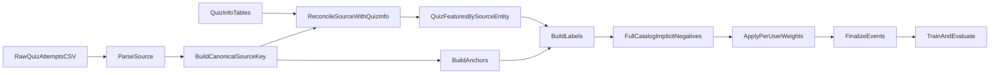

# Replan: Source-Entity Quiz Pipeline

## Goal
Migrate item identity from attempt IDs to source-derived quiz entities, then rebuild labels so each anchor is evaluated against the full quiz catalog (implicit negatives), while keeping all anchors and balancing heavy users with per-user weighting.

## Locked Decisions
- **Item identity:** canonical source entity from `quiz_attempts.source`
  - `course-{course_id}-{topic_id}-{quiz_id}`
  - `skill-{skill_id}-{level}`
- **Anchor policy:** all attempts are anchors (no subsampling, no hard caps).
- **Negative policy:** full-catalog implicit negatives per anchor:
  - positives = source entities solved in `(Tq, Tq + H]`
  - negatives = all catalog entities not in that positive set
- **Balancing:** per-user weighting (weight-only; no cap fallback in this phase).

## Proposed Data Contract
- Keep source string as canonical key: `source_key`.
- Optional compact integer mapping for model arrays: `quiz_entity_idx`.
- Keep `quiz_attempt_id` only as lineage/debug context.
- Events columns migrate to:
  - `anchor_source_key`
  - `target_source_key`
  - optional `anchor_quiz_attempt_id`
  - `label`, `event_time`, `activity_eligible`, `weight`, `shuffle_part`

## Execution Plan
1. **EDA gate for source/quiz-info reconciliation**
   - Validate parse coverage for `source` and unknown/malformed rates.
   - Reconcile source entities against `data/quiz_info/*` and available problem-set metadata.
   - Produce acceptance checks: entity cardinality, coverage, mismatch buckets.

2. **Canonical source parsing + identity mapping**
   - Add deterministic parser for course/skill source formats.
   - Build canonical `source_key`; optionally derive stable `quiz_entity_idx`.
   - Define explicit handling for unparseable rows (drop + counters).

3. **Re-key quiz features to source entities**
   - Rebuild quiz feature outputs keyed by `source_key` (attempt ID no longer vocab key).
   - Ensure deterministic one-row-per-entity behavior.
   - Update feature bundle IO and export contracts.

4. **Refactor events pipeline semantics**
   - Anchors and targets keyed by `source_key`.
   - For each anchor, collect in-horizon positive source entities.
   - Generate full implicit negatives from full entity catalog minus positives.
   - Preserve determinism and bump manifest schema/version contract accordingly.

5. **Apply per-user weighting end-to-end**
   - Compute per-user balancing weights over event rows.
   - Propagate weights through dataset assembly/training/eval.
   - Keep weighting policy transparent in manifest + docs.

6. **Migrate consumers + pipeline wiring**
   - Update preprocessing, feature arrays, dataset loaders, training/eval, demo retrieval.
   - Update scripts, `params.yaml`, and `dvc.yaml` to the new key semantics.

7. **Tests first, then docs**
   - Add parser tests (`course-*`, `skill-*`, malformed cases).
   - Add EDA contract tests for parse coverage/reconciliation thresholds.
   - Update events tests for full-negative semantics and deterministic outputs.
   - Update training/eval tests for source-entity vocab and weighting behavior.
   - Sync docs: pipeline schema, design docs, README, memory.

## Post-Migration Flow

## Acceptance Criteria
- Retrieval vocab/targets are source-entity based (attempt ID is lineage-only).
- Labels use deterministic full-catalog implicit negatives.
- All anchors retained; per-user weighting active and documented.
- Source-to-quiz-info reconciliation passes agreed checks.
- End-to-end DVC repro works with updated schema.
- Updated unit/integration tests pass for new contract.
